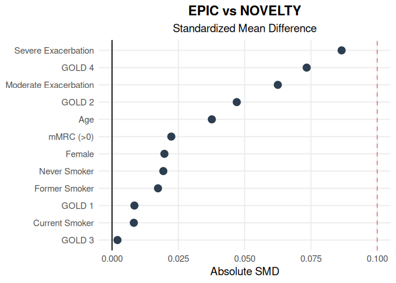

# Baseline Characteristics NOVELTY vs. EPIC

------------------------------------------------------------------------

## 1. Process EPIC Simulation Data

The EPIC simulation (`epic_selected`) outputted from the Copula model
are standardized into numeric formats (0/1 for binary and categorical,
continuous for others) to facilitate statistical comparison.”

## 2. Generate Table 1 and Determine **Standardized Mean Difference**

Baseline characteristics are presented, reporting the Mean (SD) for
continuous variables and counts with percentages for binary and
categorical variables. The Standardized Mean Difference (SMD) is
calculated to assess balance. For binary and categorical variables, SMDs
are calculated by treating the variable as a binary (0/1) indicator,
where the standard deviation is derived from the proportion.

| Variable                     | NOVELTY      | EPIC         | SMD   | Status      |
|:-----------------------------|:-------------|:-------------|:------|:------------|
| Total Number of Patients (N) | 465          | 10000        |       |             |
| Age                          | 65.30 (9.30) | 65.64 (8.88) | 0.038 | 🟢 Balanced |
| Female                       | 40.30%       | 41.27%       | 0.020 | 🟢 Balanced |
| GOLD 1                       | 4.70%        | 4.88%        | 0.008 | 🟢 Balanced |
| GOLD 2                       | 39.60%       | 41.91%       | 0.047 | 🟢 Balanced |
| GOLD 3                       | 39.80%       | 39.90%       | 0.002 | 🟢 Balanced |
| GOLD 4                       | 15.90%       | 13.31%       | 0.073 | 🟢 Balanced |
| Never Smoker                 | 5.80%        | 6.26%        | 0.019 | 🟢 Balanced |
| Current Smoker               | 34.20%       | 34.59%       | 0.008 | 🟢 Balanced |
| Former Smoker                | 60.00%       | 59.15%       | 0.017 | 🟢 Balanced |
| Moderate Exacerbation        | 0.28 (0.68)  | 0.24 (0.47)  | 0.063 | 🟢 Balanced |
| Severe Exacerbation          | 0.23 (0.56)  | 0.19 (0.39)  | 0.087 | 🟢 Balanced |
| mMRC (\>0)                   | 91.30%       | 90.66%       | 0.022 | 🟢 Balanced |

Table 1: Comparison of NOVELTY vs. EPIC Cohort

## 3. Visual Comparison

Below is a visualization of the Standardized Mean Differences (SMD) for
the baseline characteristics. The red dashed line at **0.1** represents
the SMD threshold representing a balanced comparative cohort.

## 4. External Validation: Comparing EPIC and NOVELTY Results

This section executes the negative binomial model for the EPIC cohort to
estimate exacerbation outcomes. The rate ratios are then compared
between the NOVELTY and EPIC cohort.

| Outcome | Medication Category | NOVELTY | EPIC | p value |
|:---|:---|:---|:---|:---|
| Moderate Exacerbations | No Therapy (Reference) | 0.087 (0.043, 0.177) | 0.171 (0.162, 0.180) | \<0.001 |
| Moderate Exacerbations | Monotherapy | 0.529 (0.159, 1.757) | 1.008 (0.946, 1.075) | 0.804 |
| Moderate Exacerbations | Dual Therapy | 0.538 (0.220, 1.315) | 1.620 (1.428, 1.838) | \<0.001 |
| Moderate Exacerbations | Triple Therapy | 1.212 (0.566, 2.597) | 1.904 (1.768, 2.050) | \<0.001 |
| Severe Exacerbations | No Therapy (Reference) | 0.022 (0.008, 0.065) | 0.038 (0.035, 0.042) | \<0.001 |
| Severe Exacerbations | Monotherapy | 2.283 (0.638, 8.167) | 1.058 (0.949, 1.180) | 0.311 |
| Severe Exacerbations | Dual Therapy | 3.108 (1.031, 9.373) | 2.262 (1.875, 2.728) | \<0.001 |
| Severe Exacerbations | Triple Therapy | 5.446 (1.866, 15.898) | 2.953 (2.636, 3.307) | \<0.001 |

Table 2: EPIC vs NOVELTY Exacerbation Rate Ratios (95% CI)

## 5: External Validation: Comparing Rate of Exacerbations between EPIC and NOVELTY

This section compares the annual rate (per person per year) of moderate
and severe exacerbations between NOVELTY and EPIC.

| Outcome | Medication Category | NOVELTY | EPIC |
|:---|:---|:---|:---|
| Moderate Exacerbations | No Therapy (Reference) | 0.087 (0.043, 0.177) | 0.171 (0.162, 0.180) |
| Moderate Exacerbations | Monotherapy | 0.046 (0.007, 0.311) | 0.172 (0.153, 0.193) |
| Moderate Exacerbations | Dual Therapy | 0.047 (0.009, 0.233) | 0.277 (0.231, 0.331) |
| Moderate Exacerbations | Triple Therapy | 0.105 (0.024, 0.460) | 0.326 (0.286, 0.369) |
| Severe Exacerbations | No Therapy (Reference) | 0.022 (0.008, 0.065) | 0.038 (0.035, 0.042) |
| Severe Exacerbations | Monotherapy | 0.050 (0.005, 0.531) | 0.040 (0.033, 0.050) |
| Severe Exacerbations | Dual Therapy | 0.068 (0.008, 0.609) | 0.086 (0.066, 0.115) |
| Severe Exacerbations | Triple Therapy | 0.120 (0.015, 1.033) | 0.112 (0.092, 0.139) |

Table 3: Comparison of Average Annualized Exacerbation Rates (95% CI)
